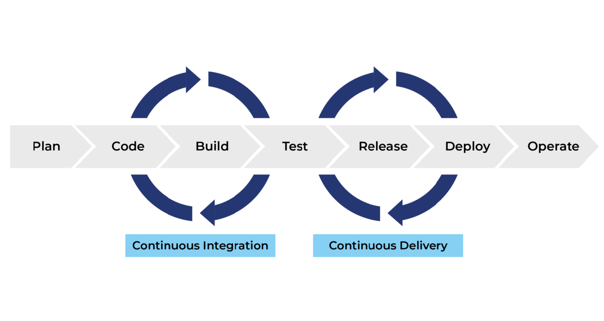

# CI/CD Pipeline Implementations

## CI/CD Pipeline Demonstration Repositoy

This repository contains multiple **CI/CD pipeline implementations** designed to demonstrate modern **DevOps automation practices** across different deployment platforms.
Each **branch represents a specific CI/CD architecture** using different technologies, cloud services, or deployment targets.
The goal of this repository is to showcase **real-world DevOps workflows**, including:

- Continuous Integration
- Automated Testing
- Code Quality Scanning
- Security Scanning
- Containerization
- Image Registry Management
- Automated Deployment

---

## Repository Structure Strategy

The **Main branch** acts as in **index and documentation hub**.
Each **feature branch** demonstrates a full CI/CD pipeline for a specific stack.
Example:

| Branch                         | Description                                                   |
| ------------------------------ | ------------------------------------------------------------- |
| `springboot-ecs-cicd-pipeline` | CI/CD pipeline deploying a Spring Boot application to AWS ECS |

---

## Purpose of This Repository

This project is created to:

- Demonstrate **DevOps pipeline design**
- Showcase **automation skills**
- Provide **real-world CI/CD examples**
- Serve as a **portfolio project for DevOps roles**
