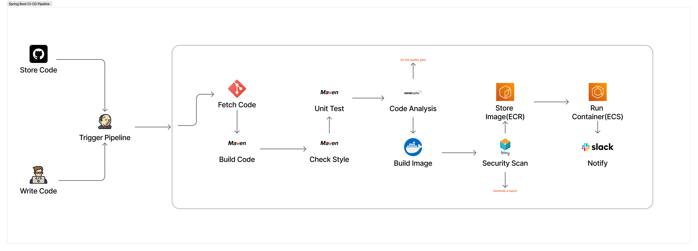
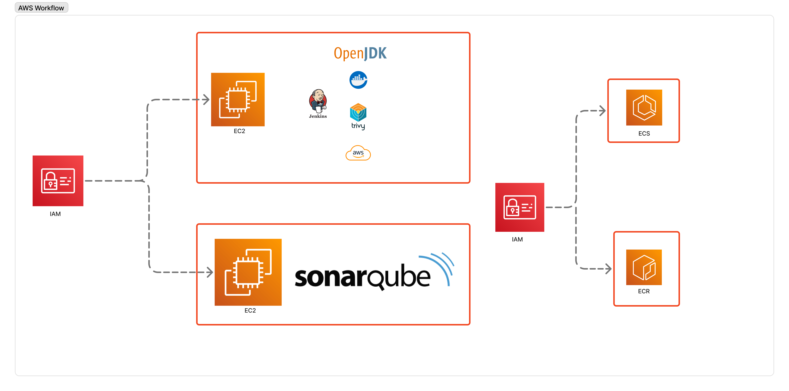
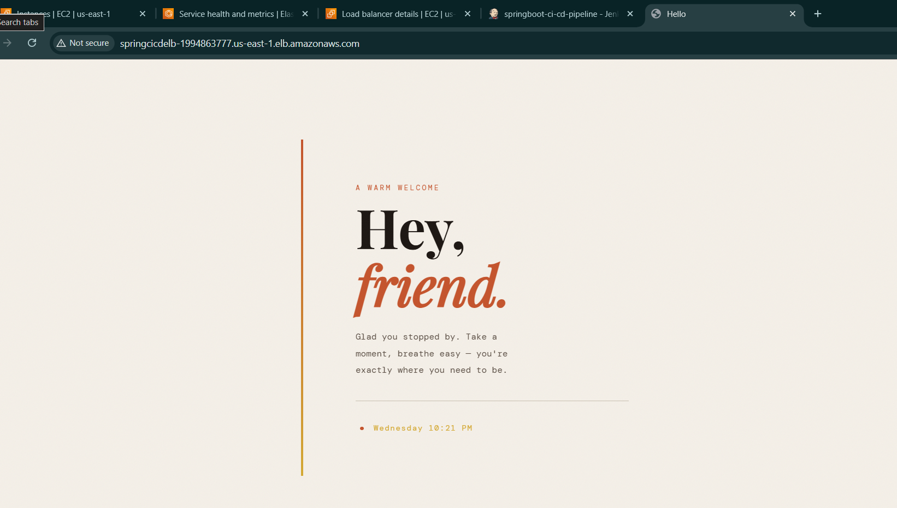

# CI/CD Pipeline Implementations

## Workflow

  

## AWS Infra

  

### Jenkins Server Setup

- Tools Installed
  - Docker Engine
  - Trivy (Security Scanning)
  - AWS CLI
  - OpenJDK (17 & 21)
- Jenkins Plugins
  - Git
  - Pipeline Maven Integration
  - Docker
  - Docker Pipeline
  - AWS Credentials
  - Amazon Web Services SDK:: all
  - Pipeline: AWS Steps
  - SonarQube Scanner
  - Build Timestamp
  - CloudBees Docker Build and Publish
  - Slack Notification

---

### Result

  

